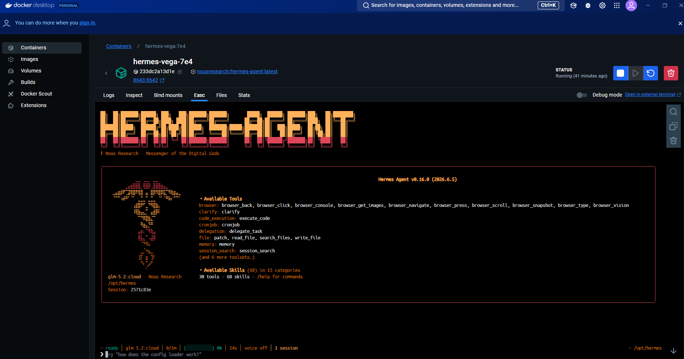

# Deploy Hermes Docker Agent

Deploy a randomized local Docker-hosted Hermes Agent that uses Ollama Cloud for model access and SearXNG for web search.



## What It Creates

- A Docker container named `hermes-<agent-slug>`
- A private data directory at `$HOME/.hermes-agents/<agent-slug>`
- Hermes config for `ollama-cloud` with model `glm-5.2:cloud`
- SearXNG search configured for `https://searxng.hoyack.ai`
- A loopback-only API endpoint at `http://127.0.0.1:<port>/health`
- A per-agent `SOUL.md` and runtime README in the data directory

The helper does not configure Slack, messaging channels, or public dashboards.

## Requirements

- Docker
- `python3`
- An Ollama Cloud API key

The key can be provided with `OLLAMA_API_KEY` or entered at the script's hidden prompt. Do not paste API keys into chat or commit them to this repo.

## Quick Start

From this skill directory:

```bash
cd deploy-hermes-docker-agent
./scripts/deploy-hermes-docker-agent.sh
```

Or pass the key through the environment:

```bash
OLLAMA_API_KEY="..." ./scripts/deploy-hermes-docker-agent.sh
```

If you prefer a local dotenv file, copy the example and fill in your own key:

```bash
cp .env.example .env
$EDITOR .env
set -a
. ./.env
set +a
./scripts/deploy-hermes-docker-agent.sh
```

Keep `.env` local. The repository only includes `.env.example` with placeholders and safe defaults.

The script chooses a short random agent name, picks the first available loopback port starting at `8642`, writes config under `$HOME/.hermes-agents`, and starts the Docker container.

## Optional Settings

Override defaults with environment variables:

```bash
HERMES_AGENT_NAME="Vega-7e4" \
HERMES_HOST_PORT="8643" \
HERMES_MODEL="glm-5.2:cloud" \
SEARXNG_URL="https://searxng.hoyack.ai" \
OLLAMA_API_KEY="..." \
./scripts/deploy-hermes-docker-agent.sh
```

Useful variables:

- `HERMES_AGENT_NAME`: display name used to derive the container slug
- `HERMES_HOST_PORT`: host port bound to `127.0.0.1`
- `HERMES_MODEL`: Ollama Cloud model
- `HERMES_IMAGE`: Docker image, default `nousresearch/hermes-agent:latest`
- `HERMES_DATA_PARENT`: data root, default `$HOME/.hermes-agents`
- `SEARXNG_URL`: search backend URL
- `HERMES_TIMEZONE`: timezone, default `America/Chicago`

## Verify Deployment

After the script finishes, use the values printed in the terminal:

```bash
docker ps --filter "name=hermes-"
curl -sS http://127.0.0.1:<host-port>/health
docker exec <container-name> hermes status
docker exec <container-name> hermes doctor
```

Expected health response:

```json
{"status":"ok","platform":"hermes-agent","version":"0.16.0"}
```

Some `hermes doctor` warnings can be non-blocking, especially optional provider credentials, missing messaging channel auth, or local symlink checks inside the container.

## Use The TUI

Open a fresh Hermes TUI:

```bash
docker exec -it <container-name> hermes --tui
```

Resume the latest TUI session:

```bash
docker exec -it <container-name> hermes --tui --continue
```

## Operate The Container

```bash
docker start <container-name>
docker stop <container-name>
docker restart <container-name>
docker logs -f <container-name>
docker exec <container-name> hermes status
```

The container uses `--restart unless-stopped`, so it should come back after Docker restarts unless you explicitly stop it.

## Remove An Agent

Stop and remove the container:

```bash
docker stop <container-name>
docker rm <container-name>
```

Remove its data directory only after confirming you no longer need its config or sessions:

```bash
trash "$HOME/.hermes-agents/<agent-slug>"
```

Use `trash` instead of `rm` when available so the data can be recovered.
