# MS Paint — Complete UI Reference (Windows 11)

This skill maps every interactive element in Microsoft Paint (Windows 11
version) so that an automation agent can identify, locate, and operate
any Paint feature. Each element includes a cropped screenshot reference,
its screen coordinates (for a maximized 1920x1080 window), and its
function.

**Dependencies:** Requires the `desktop-control-windows` skill for all
mouse/keyboard/screenshot operations.

---

## Application identity

| Property          | Value                                  |
|-------------------|----------------------------------------|
| Window title      | `Untitled - Paint` (or `<filename> - Paint`) |
| Launch command    | `mspaint` (via Win+R)                  |
| Process name      | `mspaint.exe`                          |
| App icon          | Colorful paint palette (blue/green/red/yellow) |
| Icon reference    |  |
| Titlebar ref      | 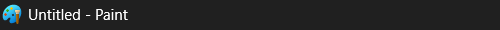 |

### How to find Paint

```bash
# Check if Paint is open
mcporter call desktop.pyautogui_getWindowsWithTitle --args '{"title":"Paint"}'

# Launch Paint
mcporter call desktop.pyautogui_hotkey --args '{"keys":["win","r"]}'
sleep 0.5
mcporter call desktop.pyautogui_typewrite --args '{"message":"mspaint"}'
sleep 0.2
mcporter call desktop.pyautogui_press --args '{"keys":["enter"]}'
sleep 2
```

---

## Window layout (maximized, 1920x1080)

```
┌──────────────────────────────────────────────────────────┐
│ [icon] Untitled - Paint                    [—] [□] [×]   │  ← Title bar (y≈0-25)
├──────────────────────────────────────────────────────────┤
│ File  Edit  View  [💾] [↗] [↩] [↪]         [👤] [⚙]     │  ← Menu bar (y≈25-55)
├──────────────────────────────────────────────────────────┤
│ Selection│Image│Tools│Brushes│  Shapes  │Outline│ Colors │  ← Ribbon rows 1-3
│          │     │     │       │          │ Fill  │        │    (y≈55-190)
│          │     │     │       │          │ Size  │Copilot │
│          │     │     │       │          │       │Layers  │
├──┬───────┴─────┴─────┴───────┴──────────┴───────┴────────┤
│Z │                                                       │
│o │              CANVAS (white drawing area)               │  ← Canvas (y≈200-1000)
│o │                                                       │
│m │                                                       │
├──┴───────────────────────────────────────────────────────┤
│ [cursor coords]  [canvas size]     [🔍-] ──●── [🔍+] %  │  ← Status bar (y≈1000-1030)
└──────────────────────────────────────────────────────────┘
```

### Key coordinate zones

| Zone              | Y range   | X range     | Notes                     |
|-------------------|-----------|-------------|---------------------------|
| Title bar         | 0–25      | 0–1920      | App icon at (12, 12)      |
| Menu bar          | 25–55     | 0–400       | File/Edit/View + quick access |
| Ribbon            | 55–190    | 0–1500      | 3 rows of tool icons      |
| Zoom slider       | 200–900   | 5–45        | Left edge vertical slider |
| Canvas            | ~200–1000 | ~100–1800   | Varies with zoom/resize   |
| Status bar        | 1000–1030 | 0–1920      | Coords, size, zoom        |
| Windows taskbar   | 1040–1080 | 0–1920      | Not part of Paint         |

---

## Title bar and window controls

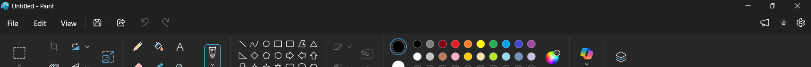

| Element         | Screen coords  | Icon reference | Function |
|-----------------|----------------|----------------|----------|
| App icon        | (12, 12)       |  | Paint palette icon — click for system menu |
| Window title    | (100, 12)      | — | Shows filename + "Paint" |
| Minimize (—)    | (1845, 8)      | 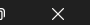 | Minimize to taskbar |
| Maximize (□)    | (1882, 8)      | — | Toggle maximize/restore |
| Close (×)       | (1908, 8)      | — | Close Paint |

---

## Menu bar + Quick Access toolbar

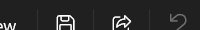

| Element     | Screen coords | Shortcut  | Function |
|-------------|---------------|-----------|----------|
| **File**    | (30, 45)      | —         | Opens File menu |
| **Edit**    | (75, 45)      | —         | Opens Edit menu |
| **View**    | (133, 45)     | —         | Opens View menu |
| Save        | (190, 45)     | Ctrl+S    | Save current file |
| Share       | (230, 45)     | —         | Share/export |
| Undo        | (290, 45)     | Ctrl+Z    | Undo last action |
| Redo        | (325, 45)     | Ctrl+Y    | Redo undone action |

### Top-right icons

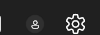

| Element     | Screen coords  | Function |
|-------------|----------------|----------|
| Account     | (1875, 45)     | Microsoft account |
| Settings    | (1910, 45)     | Paint settings gear |

---

## File menu

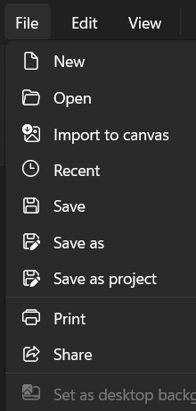
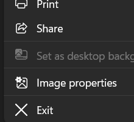

| Item                      | Shortcut     | Function |
|---------------------------|--------------|----------|
| New                       | Ctrl+N       | Create new blank canvas |
| Open                      | Ctrl+O       | Open existing image file |
| Import to canvas          | —            | Import image onto current canvas |
| Recent                    | —            | Show recently opened files |
| Save                      | Ctrl+S       | Save current file |
| Save as                   | Ctrl+Shift+S | Save as new file (choose format) |
| Save as project           | —            | Save as Paint project (.paint) |
| Print                     | Ctrl+P       | Print the image |
| Share                     | —            | Share via Windows share dialog |
| Set as desktop background | —            | Set image as wallpaper (requires saved file) |
| Image properties          | Ctrl+E       | Canvas dimensions, DPI, color mode |
| Exit                      | Alt+F4       | Close Paint |

---

## Edit menu

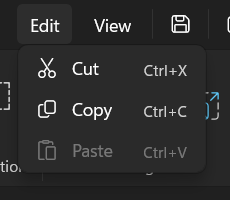

| Item   | Shortcut | Function |
|--------|----------|----------|
| Cut    | Ctrl+X   | Cut selection to clipboard |
| Copy   | Ctrl+C   | Copy selection to clipboard |
| Paste  | Ctrl+V   | Paste from clipboard |

---

## View menu

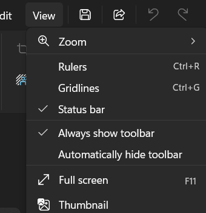

| Item                       | Shortcut | Function |
|----------------------------|----------|----------|
| Zoom                       | → submenu | Zoom in/out, fit to window |
| Rulers                     | Ctrl+R   | Toggle pixel rulers on edges |
| Gridlines                  | Ctrl+G   | Toggle pixel grid overlay |
| Status bar                 | —        | Toggle bottom status bar |
| Always show toolbar        | —        | Keep ribbon always visible |
| Automatically hide toolbar | —        | Auto-hide ribbon |
| Full screen                | F11      | Enter fullscreen mode |
| Thumbnail                  | —        | Show thumbnail preview panel |

---

## Ribbon — Section by section

The ribbon has **8 labeled sections** arranged left to right. Each section
contains icons in up to 3 rows. The ribbon spans y≈55–190 when fully
visible.

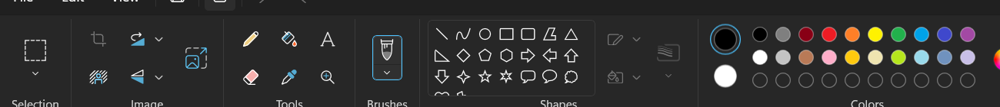
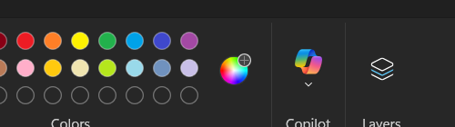

### Section 1: Selection

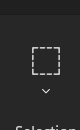

| Icon | Screen coords | Function |
|------|---------------|----------|
| Dashed rectangle (Select) | (40, 95) | Select region — click then drag to select a rectangular area. Dropdown (v) below reveals: Rectangle select, Free-form select, Select all (Ctrl+A), Invert selection, Delete selection, Transparent selection |

**Keyboard shortcut:** Ctrl+A = Select all

**Important:** Using Select or Ctrl+A switches Paint to Selection mode. You MUST re-select your drawing tool afterward before drawing.

---

### Section 2: Image

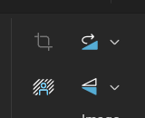

| Icon | Screen coords | Function |
|------|---------------|----------|
| Crop (overlapping corners) | (100, 80) | Crop canvas to selection bounds |
| Resize/Skew (arrows at corners) | (130, 80) | Resize image by percentage or pixels, skew by degrees |
| Rotate (blue curved arrow) | (165, 80) | Rotate/flip — dropdown reveals: Rotate right 90°, Rotate left 90°, Rotate 180°, Flip vertical, Flip horizontal |
| Flip/Transform icons (row 2) | (100–165, 115) | Additional flip and transform tools |

**Keyboard shortcuts:**
- Ctrl+W = Resize/Skew dialog
- Ctrl+R = Rotate right 90° (in some versions)

---

### Section 3: Tools

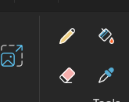

| Icon | Screen coords | Function | Visual description |
|------|---------------|----------|--------------------|
| Image/Stickers (colorful frame) | (260, 80) | Insert stickers or image overlays | Blue/green/pink frame with mountain scene |
| Pencil (yellow) | (320, 80) | Freehand drawing — 1px default | Yellow pencil icon |
| Fill (blue bucket + red drop) | (355, 80) | Flood fill area with current Color 1 | Blue container with red paint drop |
| Text (A) | (400, 80) | Insert text box on canvas | Large letter "A" |
| Eraser (pink block) | (290, 115) | Erase to background color (Color 2) | Pink/red rectangle eraser |
| Color picker / Eyedropper | (335, 115) | Sample color from canvas pixel | Blue eyedropper tool |
| Magnifier (🔍) | (375, 115) | Zoom in/out on canvas | Magnifying glass icon |

**Pencil is the most commonly used tool for freehand drawing.**
Select it before using chained `dragTo` calls for curves.

---

### Section 4: Brushes

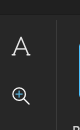
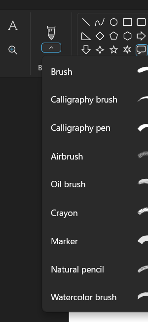

The Brushes section has a single large icon (brush/marker) with a
dropdown arrow that reveals all brush types.

| Screen coords | Function |
|---------------|----------|
| (490, 95)     | Currently selected brush — click to use, click dropdown (v) to choose brush type |

#### Brush types (dropdown)

| Brush type         | Stroke style |
|--------------------|--------------|
| Brush              | Standard round brush with soft edges |
| Calligraphy brush  | Angled thick/thin stroke |
| Calligraphy pen    | Crisp angled pen stroke |
| Airbrush           | Soft spray/spatter effect |
| Oil brush          | Thick textured paint stroke |
| Crayon             | Rough waxy texture |
| Marker             | Bold flat-tip marker stroke |
| Natural pencil     | Graphite/sketch pencil texture |
| Watercolor brush   | Translucent watercolor blending |

**9 brush types total.** Each produces a different stroke texture when
drawing with `dragTo` calls.

---

### Section 5: Shapes

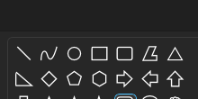
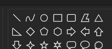

The Shapes section contains a **3-row grid of 21 shapes**. Click any
shape to select it as the active shape tool, then drag on the canvas to
draw it.

#### Row 1 — Basic shapes

| # | Shape          | Grid position | Description |
|---|----------------|---------------|-------------|
| 1 | Line           | Row 1, Col 1  | Straight line segment |
| 2 | Curve          | Row 1, Col 2  | Bezier curve (click endpoints then drag control point) |
| 3 | Oval           | Row 1, Col 3  | Circle/ellipse — drag bounding box |
| 4 | Rectangle      | Row 1, Col 4  | Square/rectangle |
| 5 | Rounded rect   | Row 1, Col 5  | Rectangle with rounded corners |
| 6 | Parallelogram  | Row 1, Col 6  | Slanted rectangle |
| 7 | Triangle       | Row 1, Col 7  | Equilateral triangle |

#### Row 2 — Polygons and arrows

| # | Shape           | Grid position | Description |
|---|-----------------|---------------|-------------|
| 8 | Right triangle  | Row 2, Col 1  | Right-angle triangle |
| 9 | Diamond         | Row 2, Col 2  | Rotated square / rhombus |
| 10 | Pentagon       | Row 2, Col 3  | 5-sided polygon |
| 11 | Hexagon        | Row 2, Col 4  | 6-sided polygon |
| 12 | Arrow right    | Row 2, Col 5  | Block arrow pointing right |
| 13 | Arrow down     | Row 2, Col 6  | Block arrow pointing down |
| 14 | Arrow left     | Row 2, Col 7  | Block arrow pointing left |
| 15 | Arrow up       | Row 2, Col 8  | Block arrow pointing up |

#### Row 3 — Stars and callouts

| # | Shape              | Grid position | Description |
|---|--------------------|---------------|-------------|
| 16 | 4-point star      | Row 3, Col 1  | Four-pointed star |
| 17 | 5-point star      | Row 3, Col 2  | Classic 5-pointed star |
| 18 | 6-point star      | Row 3, Col 3  | Six-pointed star (Star of David) |
| 19 | Speech bubble (rect) | Row 3, Col 4 | Rectangular speech/callout bubble |
| 20 | Speech bubble (round) | Row 3, Col 5 | Rounded speech bubble |
| 21 | Thought bubble    | Row 3, Col 6  | Cloud-shaped thought bubble |

#### How to draw a shape

```bash
# 1. Click the desired shape in the grid
mcporter call desktop.pyautogui_click --args '{"x":SHAPE_X,"y":SHAPE_Y}'
sleep 0.3

# 2. Verify selection (zoom toolbar to check blue highlight)
desktop-screenshot /tmp/verify.png --region SHAPES_AREA

# 3. Draw by dragging from top-left to bottom-right of bounding box
mcporter call desktop.pyautogui_mouseDown --args '{"x":TL_X,"y":TL_Y,"button":"left"}'
mcporter call desktop.pyautogui_moveTo --args '{"x":BR_X,"y":BR_Y,"duration":1.0}'
mcporter call desktop.pyautogui_mouseUp --args '{"x":BR_X,"y":BR_Y,"button":"left"}'
sleep 0.3

# 4. Click away to commit the shape
mcporter call desktop.pyautogui_click --args '{"x":NEUTRAL_X,"y":NEUTRAL_Y}'
```

#### Shape coordinate reference (approximate screen positions in grid)

The shapes grid starts at approximately **(550, 70)** and each cell is
roughly **25×25 pixels**. To click a specific shape:

```
shape_x = 555 + (col - 1) * 25
shape_y = 75 + (row - 1) * 25
```

Where row = 1–3 and col = 1–8.

---

### Outline, Fill, and Size controls

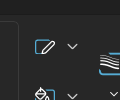

These controls sit between the Shapes and Colors sections. They modify
how shapes are drawn.

| Control | Screen coords | Function |
|---------|---------------|----------|
| Outline style | (785, 78) | Dropdown: No outline, Solid color, Crayon, Marker, Oil, Natural pencil, Watercolor, Calligraphy pen |
| Fill style | (830, 78) | Dropdown: No fill, Solid color, Crayon, Marker, Oil, Natural pencil, Watercolor, Calligraphy pen |
| Size | (800, 110) | Dropdown: Line thickness in pixels |

**Note:** Outline/fill dropdowns may only activate when a shape tool is
selected as the current tool.

---

### Section 6: Colors

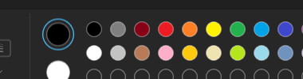
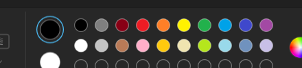

The Colors section contains:
1. **Color 1** (foreground) — large circle with blue ring when selected
2. **Color 2** (background) — large circle
3. **Preset color grid** — 2 rows of color circles
4. **Edit Colors** button — color wheel icon with "+" to pick custom colors

#### Color 1 and Color 2

| Element | Screen coords | Function |
|---------|---------------|----------|
| Color 1 (foreground) | (895, 82) | Left-click drawing color. Blue ring = active. Click to make active, then click any preset to set it. |
| Color 2 (background) | (895, 115) | Right-click drawing color / eraser color. Click to make active, then click any preset to set it. |

#### Preset color grid

**Row 1 (top)** — Starting at approximately x≈930, y≈78:

| Position | Color        | Approximate RGB |
|----------|--------------|-----------------|
| 1        | Black        | (0, 0, 0)      |
| 2        | Gray         | (127, 127, 127) |
| 3        | Dark Red     | (136, 0, 21)   |
| 4        | Red          | (237, 28, 36)  |
| 5        | Orange       | (255, 127, 39) |
| 6        | Yellow       | (255, 242, 0)  |
| 7        | Green        | (34, 177, 76)  |
| 8        | Teal/Cyan    | (0, 162, 232)  |
| 9        | Blue         | (63, 72, 204)  |
| 10       | Purple       | (163, 73, 164) |
| 11       | Pink/Magenta | (255, 0, 255)  |

**Row 2 (bottom)** — Starting at approximately x≈930, y≈110:

| Position | Color         | Approximate RGB |
|----------|---------------|-----------------|
| 1        | White         | (255, 255, 255) |
| 2        | Light Gray    | (195, 195, 195) |
| 3        | Brown/Tan     | (185, 122, 87) |
| 4        | Rose/Pink     | (255, 174, 201) |
| 5        | Light Orange  | (255, 201, 14) |
| 6        | Cream/Pale Yellow | (239, 228, 176) |
| 7        | Light Green   | (181, 230, 29) |
| 8        | Light Teal    | (153, 217, 234) |
| 9        | Light Blue    | (112, 146, 190) |
| 10       | Lavender      | (200, 191, 231) |
| 11       | Light Pink    | (255, 200, 255) |

#### Edit Colors (custom color picker)

| Element | Screen coords | Function |
|---------|---------------|----------|
| Edit Colors (+) | (≈1230, 95) | Opens the custom color picker dialog with full spectrum and RGB/HSL inputs |

#### Color grid coordinate formula

Each color circle is approximately **25px** diameter with **3px** spacing.
To click a specific color:

```
color_x = 930 + (position - 1) * 28
color_y_row1 = 82
color_y_row2 = 112
```

---

### Section 7: Copilot

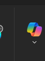

| Element | Screen coords | Function |
|---------|---------------|----------|
| Copilot icon (colorful blocks) | (1365, 95) | Microsoft Copilot AI features — dropdown for AI-powered image generation, background removal, etc. |

---

### Section 8: Layers

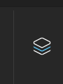

| Element | Screen coords | Function |
|---------|---------------|----------|
| Layers icon (stacked diamonds) | (1440, 95) | Open/toggle Layers panel — allows multiple drawing layers with opacity and visibility controls |

---

## Side panel — Zoom slider

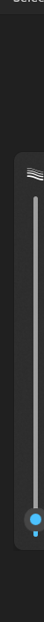

A vertical zoom slider on the left edge of the window.

| Element | Screen coords | Function |
|---------|---------------|----------|
| Zoom slider track | (22, 250–850) | Drag the blue dot to zoom in/out |
| Zoom dot (current) | (22, ~750) | Current zoom level indicator |

---

## Status bar

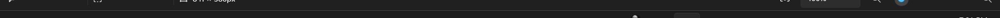
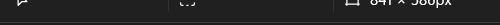
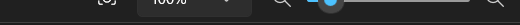

| Element | Screen coords | Function |
|---------|---------------|----------|
| Cursor position | (30, 1010) | Shows mouse X,Y pixel coordinates on canvas |
| Canvas dimensions | (250, 1010) | Shows "841 × 560px" (width × height) |
| Zoom out (🔍−) | (1680, 1010) | Decrease zoom level |
| Zoom slider | (1700–1820, 1010) | Horizontal zoom slider |
| Zoom in (🔍+) | (1840, 1010) | Increase zoom level |
| Zoom percentage | (1620, 1010) | Shows current zoom % (e.g., "100%") |

---

## Canvas interaction reference

### Finding the canvas

The canvas is the **white rectangular area** in the center. Its exact
position depends on zoom level, window size, and ribbon state. **Always
measure canvas bounds** via pixel color scanning before drawing:

```bash
# Scan vertically to find top/bottom of white area
for y in 200 250 300 350 400 450; do
  mcporter call desktop.pyautogui_pixel --args "{\"x\":960,\"y\":$y}"
done
# White = [255,255,255] → first white = canvas_top, last white = canvas_bottom

# Scan horizontally at canvas vertical center
for x in 50 100 150 200 250 300 350 400 450 500; do
  mcporter call desktop.pyautogui_pixel --args "{\"x\":$x,\"y\":CANVAS_VMID}"
done
# First white = canvas_left, last white = canvas_right
```

### Typical canvas bounds (maximized, 100% zoom, default canvas)

```
canvas_left   ≈ 107
canvas_right  ≈ 948
canvas_top    ≈ 200
canvas_bottom ≈ 760
canvas_center ≈ (528, 480)
canvas_size   ≈ 841 × 560
```

**These are approximate — always measure.**

---

## Keyboard shortcuts reference

| Shortcut       | Action |
|----------------|--------|
| Ctrl+N         | New canvas |
| Ctrl+O         | Open file |
| Ctrl+S         | Save |
| Ctrl+Shift+S   | Save As |
| Ctrl+P         | Print |
| Ctrl+Z         | Undo |
| Ctrl+Y         | Redo |
| Ctrl+X         | Cut |
| Ctrl+C         | Copy |
| Ctrl+V         | Paste |
| Ctrl+A         | Select all (**changes tool to Selection!**) |
| Ctrl+E         | Image properties (canvas size) |
| Ctrl+W         | Resize/Skew dialog |
| Ctrl+R         | Toggle rulers |
| Ctrl+G         | Toggle gridlines |
| Delete          | Delete selection |
| F11            | Full screen |
| Esc            | Cancel selection / close dialog |
| +/−            | Zoom in/out |
| Ctrl+Page Up   | Zoom in |
| Ctrl+Page Down | Zoom out |

---

## Tool selection procedure

Selecting any tool requires the **two-pass zoom observation** from the
`desktop-control-windows` skill. Never guess coordinates from a
full-screen screenshot.

### General procedure

1. **Survey** — take full-screen screenshot, identify approximate ribbon location
2. **Zoom** — crop the relevant ribbon section:
   ```bash
   desktop-screenshot /tmp/section.png --region SECTION_X,65,SECTION_W,130
   ```
3. **Read** the zoomed image, identify the target icon
4. **Ground coordinates** — show the math:
   ```
   Crop region: --region 540,65,240,130
     → crop_origin = (540, 65)
   Target icon in crop: pixel (85, 22)
     → screen coordinate = (540+85, 65+22) = (625, 87)
   ```
5. **Click** the icon
6. **Verify** — zoom the same area again, confirm blue highlight on correct icon

### Quick-reference coordinates by tool

These are approximate for a maximized window. **Always verify with a
zoomed screenshot before clicking.**

| Tool              | Section   | Approx screen coords |
|-------------------|-----------|---------------------|
| Select            | Selection | (40, 95)            |
| Crop              | Image     | (100, 80)           |
| Resize            | Image     | (130, 80)           |
| Rotate            | Image     | (165, 80)           |
| Stickers/Image    | Tools     | (260, 80)           |
| Pencil            | Tools     | (320, 80)           |
| Fill              | Tools     | (355, 80)           |
| Text              | Tools     | (400, 80)           |
| Eraser            | Tools     | (290, 115)          |
| Color picker      | Tools     | (335, 115)          |
| Magnifier         | Tools     | (375, 115)          |
| Brush (main)      | Brushes   | (490, 95)           |
| Oval shape        | Shapes    | (605, 75)           |
| Rectangle shape   | Shapes    | (630, 75)           |
| Line shape        | Shapes    | (555, 75)           |

---

## Common workflows

### Draw a circle

```
1. Click Oval shape (Shapes section, Row 1, Col 3)
2. Verify blue highlight on Oval
3. Click canvas to establish context
4. mouseDown at (TL_X, TL_Y)
5. moveTo at (BR_X, BR_Y) with duration=1.0
6. mouseUp at (BR_X, BR_Y)
7. Click away to commit
```

### Fill an area with color

```
1. Click desired color in palette (sets Color 1)
2. Click Fill tool (Tools section — blue bucket icon)
3. Verify Fill is selected
4. Click inside the area to fill
```

### Draw freehand with pencil

```
1. Click Pencil tool
2. moveTo start point
3. Chain dragTo calls for each segment (duration ≥ 0.2)
```

### Change line thickness

```
1. Select a drawing tool (Pencil, Brush, Shape)
2. Click Size dropdown (between Shapes and Colors sections)
3. Select desired thickness
```

### Use a custom color

```
1. Click Edit Colors (+) button
2. In the dialog, select color from spectrum or enter RGB values
3. Click OK
4. The custom color is now Color 1
```

---

## Asset file inventory

All reference screenshots are stored in `assets/` relative to this file:

```
assets/
├── icons/
│   ├── app_icon.png              — Paint application icon (title bar)
│   ├── app_icon_titlebar.png     — Icon cropped from title bar
│   ├── titlebar_full.png         — Full title bar with title text
│   ├── window_controls.png       — Minimize/Maximize/Close buttons
│   ├── top_right_icons.png       — Account + Settings icons
│   └── settings_area.png         — Settings gear detail
├── menus/
│   ├── file_menu.png             — File dropdown (top portion)
│   ├── file_menu_bottom.png      — File dropdown (bottom portion)
│   ├── edit_menu.png             — Edit dropdown
│   ├── view_menu.png             — View dropdown
│   ├── view_zoom_submenu.png     — View > Zoom submenu
│   └── menubar.png               — Menu bar strip
├── ribbon/
│   ├── 00_complete_header.png    — Full header master reference
│   ├── 00_ribbon_master.png      — Full ribbon strip
│   ├── ribbon_labeled_full.png   — Ribbon with section labels visible
│   ├── ribbon_labeled_left.png   — Left sections with labels
│   ├── ribbon_labeled_right.png  — Right sections with labels
│   ├── 01_selection.png          — Selection section detail
│   ├── 02_image.png              — Image section detail
│   ├── 03_tools.png              — Tools section detail
│   ├── 04_brushes.png            — Brushes section detail
│   ├── brushes_dropdown.png      — All 9 brush types
│   ├── 05_shapes.png             — Shapes section detail
│   ├── shapes_gallery.png        — Full shapes grid popup
│   ├── shapes_detail.png         — Shapes 3-row grid detail
│   ├── shapes_row3.png           — Third row of shapes
│   ├── outline_fill_controls.png — Outline/Fill/Size controls
│   ├── 06_colors.png             — Colors section detail
│   ├── 09_copilot.png            — Copilot section
│   ├── 10_layers.png             — Layers section
│   └── quick_access.png          — Quick access toolbar
├── colors/
│   ├── palette_full.png          — Color 1/2 + preset grid
│   ├── palette_extended.png      — Full palette with Edit Colors
│   ├── color_controls.png        — Outline/fill near colors
│   ├── color_palette.png         — Color area overview
│   └── 06_palette.png            — Alternate palette capture
└── panels/
    ├── left_panel.png            — Zoom slider (vertical)
    ├── status_bar.png            — Full status bar
    ├── status_bar_left.png       — Cursor coords + canvas size
    └── status_bar_right.png      — Zoom controls
```

---

## Notes for automation agents

1. **Always verify tool selection** — zoom the toolbar after clicking to
   confirm the blue highlight is on the correct icon.
2. **Ctrl+A and Ctrl+Z change tool state** — after using any selection
   shortcut, re-select your drawing tool.
3. **Shape tools remain selected** after drawing but the shape has
   selection handles. Click away to commit before drawing the next shape.
4. **Canvas bounds vary** — always measure via pixel scanning before drawing.
5. **Brush/tool coordinates shift** if the ribbon is collapsed or the
   window is not maximized. Re-survey if window state changes.
6. **Color 1 vs Color 2** — left-click draws with Color 1, right-click
   draws with Color 2. The eraser uses Color 2.
7. **Edit Colors** opens a modal dialog — handle it before continuing.
8. **Copilot features** require internet connectivity and may show
   different UI depending on feature availability.
9. **Layers** is a newer Paint feature — not all versions have it.
